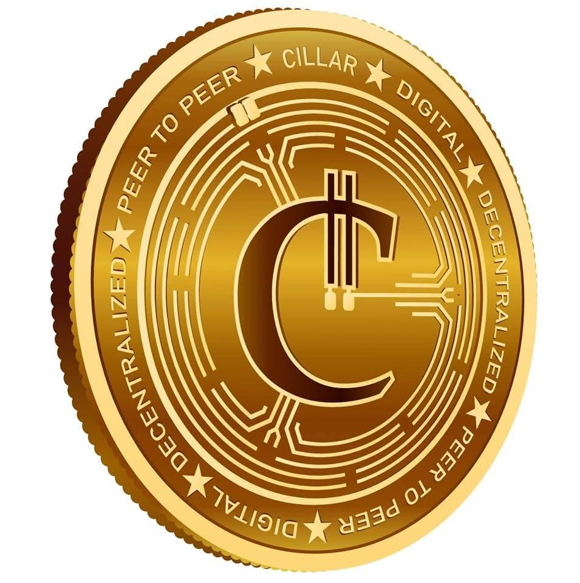
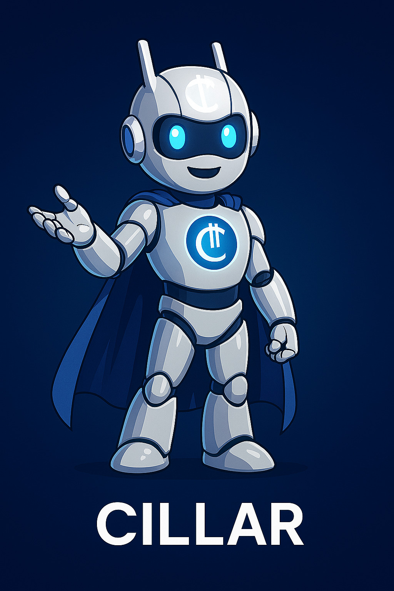
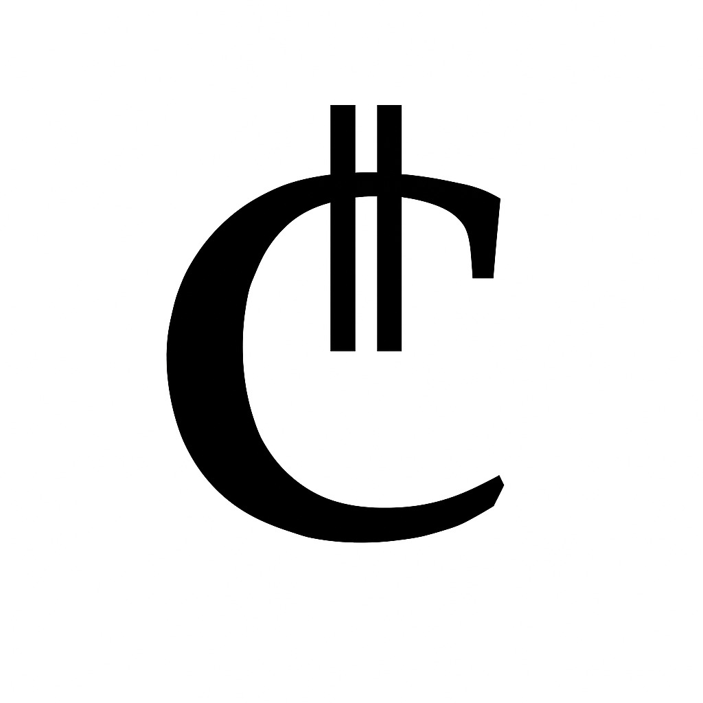
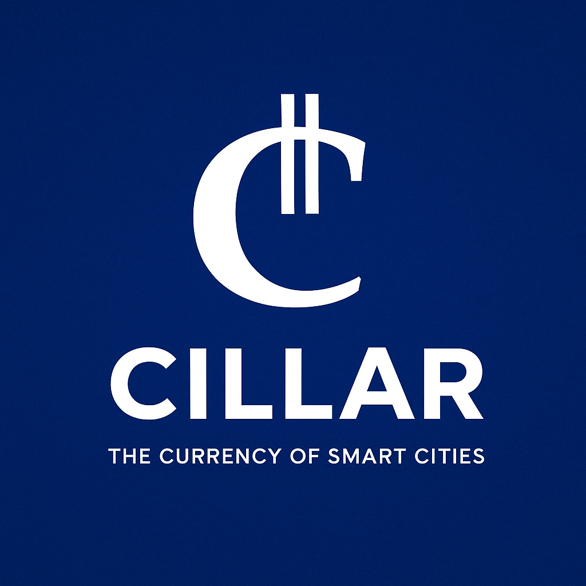

# CillarCoin Utility Token (CILLAR)

[](LICENSE)   [](SECURITY.md)

## 🚀 Initial Exchange Offering (IEO) on P2B Exchange

CillarCoin is launching its Initial Exchange Offering (IEO) on [P2B Exchange](https://p2pb2b.com), one of the leading global crypto platforms. The IEO will feature an allocation of **2,500,000,000 $CILLAR tokens** at **$0.15 USD per token**, aiming to raise **$375 million USD** to support AfrailX™ and ArailX™ smart mobility deployment, liquidity, staking, and DAO treasury.

> All IEO participants will be eligible to vote in the [Cillar DAO](https://cillar.org) and access smart mobility platforms (AfrailX & ArailX) via [Abba App](https://abbapp.com).

📖 [View Full IEO Details](./IEO.md)

### 📘 CillarCoin IEO FAQ

Get answers to the most common questions about our Initial Exchange Offering (IEO).  
[View IEO FAQ →](./IEO_FAQ.md)

----------

### 🥞 Buy on PancakeSwap

Swap BNB for $CILLAR via PancakeSwap:  
🔗 [https://pancakeswap.finance/swap?outputCurrency=0x4364a697bB204C8239b40d038F500971f6fe4D37](https://pancakeswap.finance/swap?outputCurrency=0x4364a697bB204C8239b40d038F500971f6fe4D37)

🔐 **Verified Contract on BscScan**: [0x4364a697bB204C8239b40d038F500971f6fe4D37](https://bscscan.com/token/0x4364a697bB204C8239b40d038F500971f6fe4D37)

----------

## What's CillarCoin?

**CillarCoin** ($CILLAR) is a programmable BEP-20 utility token created and developed by **Simon Kapenda**, the creator of **Abba App**, and maintained by **Abba Platforms Inc.** It is built to facilitate transit fare payments on **AfrailX** and **ArailX** smart mobility systems exclusively through the **Abba App**.

CillarCoin is designed to enable secure, flexible, and user-centric mobility payments within a decentralized infrastructure ecosystem, with future support for **community governance via DAO mechanisms** over key parameters such as rewards, pricing, and treasury allocation. See Cillar DAO website at cillar.org.

----------

## 🚇 Purpose

CillarCoin is designed to:

-   Pay for transit rides via Abba App on AfrailX and ArailX smart mobility systems
-   Earn ride rewards and loyalty bonuses
-   Enable regional, children and senior fare discounts
-   Track ride-based CO₂ emissions savings
-   Allow refundable transactions within defined windows
-   Support KYC-based user eligibility

These smart mobility systems—AfrailX in Africa and the Middle East, and ArailX in the U.S. and beyond—represent the future of clean, efficient, and scalable urban transit. CillarCoin enables seamless payments across these networks through a unified token ecosystem.

----------

## Documentation

-   [Whitepaper](docs/WHITEPAPER.md)
-   [Infrastructure & DAO Plan](docs/CILLARCOIN.md)
-   [Initial Exchange Offering (IEO)](IEO.md)
-   [IEO Demand Summary](docs/IEO_Demand_Summary.md)
-   [Technical Architecture](docs/ARCHITECTURE.md)
-   [Token Analysis](docs/ANALYSIS.md)
-   [Token Allocation](docs/ALLOCATION.md)
-   [Vesting Plan](docs/VESTING_PLAN.md)
-   [Project Roadmap](docs/ROADMAP.md)
-   [Audit Log & Status](AUDIT.md)
-   [Release Notes](RELEASE_NOTES.md)

----------

## 🚀 Deployment (Mainnet)

The CillarCoin contract has been deployed and verified on BNB Smart Chain Mainnet.  
Details available in [`deployed-contracts/`](./deployed-contracts/README.md).

🔗 [View on BscScan](https://bscscan.com/address/0x4364a697bB204C8239b40d038F500971f6fe4D37#code)

----------

## 📷 Branding

Official CillarCoin branding assets including logos and tokens are located in the [`branding`](branding/) directory.

### CillarCoin Token

Here is the official CillarCoin Token — available in the [`branding`](branding/) folder:

 

### 🪙 Cillar Mascot (Official Robot Character)

The official CillarCoin futuristic robot mascot is now part of the brand identity. This character represents automation, mobility, and precision within the Cillar ecosystem.



File: `Cillar_Futuristic_Robot_Figure.jpg`

### 🪙 CillarCoin Logo

Here are the official CillarCoin Logos — available in the [`branding`](branding/) folder:

Preview

File


`cillar-logo-white-on-blue.jpg`



`cillar-logo-black-on-white.jpg`



`cillar-logo-with-text.jpg`

----------

## 📄 Whitepaper

For full technical and economic details about CillarCoin, please refer to the [WHITEPAPER.md](docs/WHITEPAPER.md).

The whitepaper explains the purpose, utility, architecture, smart contract logic, deployment roadmap, and how CillarCoin integrates with AfrailX™, ArailX™, and the Abba App ecosystem.

----------

### 📄 CillarCoin Ecosystem – Infrastructure & Use Case Expansion Plan

A comprehensive, production-grade whitepaper detailing the technical, economic, and governance architecture of **CillarCoin ($CILLAR)** — a non-speculative BEP-20 utility token built on BNB Smart Chain. Designed specifically to power AfrailX and ArailX smart transit systems, CillarCoin extends beyond mobility to support smart city services, education credits, local governance, and decentralized marketplaces across Africa and beyond.

**Key Highlights:**

-   Built-in reward, refund, and compliance logic
-   Region-customized smart contracts (FareRegistry, DAOManager, etc.)
-   Civic-focused DAO governance with non-transferable voting tokens
-   Progressive rollout model aligned with real-world infrastructure readiness
-   Visionary path to become Africa’s first decentralized civic utility currency

> This document serves as the blueprint for scaling blockchain-backed urban infrastructure, helping governments, NGOs, and enterprises deploy programmable public services with real-world impact.

Read the whole document: [CILLARCOIN.md](docs/CILLARCOIN.md)

## 📄 Analysis

For a deep technical and ecosystem evaluation of CillarCoin, read the [ANALYSIS.md](docs/ANALYSIS.md).

The analysis covers architecture, token security, contract logic, vesting structure, rewards, regional fare logic, benefits to holders, and alignment within the AfrailX™, ArailX™, and Abba App ecosystem.

----------

## 🔗 Ecosystem Integration

Component

Role

**AFRX Token**

Investor-grade security token for infrastructure funding

**CILLAR Token**

Utility token for riders to pay fares in Abba App

**Abba App**

User-facing payment app integrated with smart contracts

**AfrailX / ArailX**

Smart mobility systems operating in target cities

----------

## 🧱 Smart Contracts

This repository contains the following contracts:

-   `CillarCoin.sol` – Main token contract with reward, refund, and KYC logic
-   `FareRegistry.sol` – Region-based fare and pricing logic
-   `CillarVesting.sol` – Treasury and vesting logic for long-term supply control

----------

## 🛠 Features

-   ✅ KYC enforcement
-   ✅ Fare reward system (e.g. every 20 rides)
-   ✅ Refundable fares within a 48-hour window
-   ✅ Operator fee forwarding to treasury
-   ✅ Configurable regional fares and senior discounts
-   ✅ CO₂ savings tracker
-   ✅ Subscription tracking

----------

## 💡 Tokenomics

-   **Token Name**: CillarCoin
-   **Ticker**: CILLAR
-   **Max Supply**: 100,000,000,000 CILLAR
-   **Total Supply**: 40,000,000,000 CILLAR
-   **Founder's Allocation**: 25,000,000,000 CILLAR (25%) to be distributed gradually
-   **IEO Allocation**: 2,500,000,000 CILLAR
-   **Initial Mint**: 15,000,000,000 CILLAR (15%) minted and live on-chain

### Distribution Plan

Category

Allocation

Public Treasury

45%

Founders & Team

25%

Ecosystem & Rewards

20%

Vesting Reserve

10%

----------

## 📦 Installation

```bash
npm install


```

To test locally with Hardhat:

```bash
npx hardhat test


```

----------

## 🤭 Project Roadmap

We are committed to maintaining CillarCoin as an enterprise-grade, production-ready token infrastructure. Our official roadmap outlines the technical and governance milestones to elevate the platform to full audit certification and DAO-readiness.

📍 [View the Enterprise Development Roadmap](docs/ROADMAP.md)

----------

## 📄 License

This project is licensed under the **MIT License**.

```
MIT License

Copyright (c) 2025 Abba Platforms Inc.

Created and developed by Simon Kapenda  
Maintained by Abba Platforms Inc.

Permission is hereby granted, free of charge, to any person obtaining a copy of this software and associated documentation files (the “Software”), to deal in the Software without restriction, including without limitation the rights to use, copy, modify, merge, publish, distribute, sublicense, and/or sell  
copies of the Software, and to permit persons to whom the Software is furnished to do so, subject to the following conditions:

The above copyright notice and this permission notice shall be included in all copies or substantial portions of the Software.

THE SOFTWARE IS PROVIDED “AS IS”, WITHOUT WARRANTY OF ANY KIND, EXPRESS OR IMPLIED, INCLUDING BUT NOT LIMITED TO THE WARRANTIES OF MERCHANTABILITY, FITNESS FOR A PARTICULAR PURPOSE AND NONINFRINGEMENT. IN NO EVENT SHALL THE AUTHORS OR COPYRIGHT HOLDERS BE LIABLE FOR ANY CLAIM, DAMAGES OR OTHER LIABILITY, WHETHER IN AN ACTION OF CONTRACT, TORT OR OTHERWISE, ARISING FROM, OUT OF OR IN CONNECTION WITH THE SOFTWARE OR THE USE OR OTHER DEALINGS IN THE SOFTWARE.


```

----------

## 🌐 Links

### Official Websites:

-   Cillar: [https://cillar.io](https://cillar.io)
-   Cillar DAO: [https://cillar.org](https://cillar.org)
-   Abba App: [https://abbapp.com](https://abbapp.com)
-   AfrailX: [https://afrailx.com](https://afrailx.com)
-   ArailX: [https://arailx.com](https://arailx.com)
-   Afrail Inc: [https://afrail.xyz](https://afrail.xyz)

----------

## 🤝 Contributions

Pull requests and audits are welcome. For questions or improvements, feel free to open an issue or contact the core team.

> Created and developed by **Simon Kapenda**, Creator of Abba App and the Afrail mobility ecosystem. Maintained by **Abba Platforms Inc.**.
