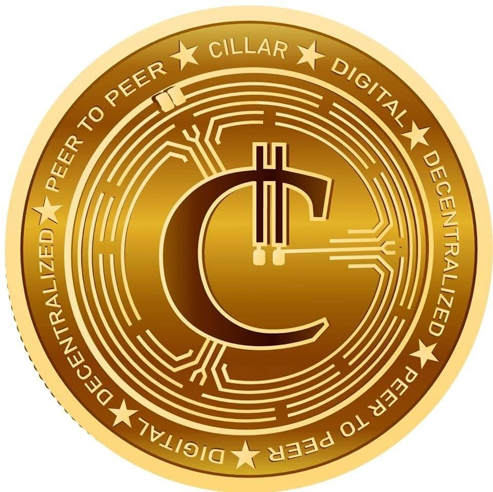

# CillarCoin (CILLAR)

**CillarCoin** is a programmable ERC-20 utility token developed by **Abba Platforms Inc.** to facilitate transit fare payments on **AfrailX** and **ArailX** smart mobility systems through the **Abba App**. It is designed to enable secure, flexible, and user-centric mobility payments within a decentralized infrastructure ecosystem.

---

## 🚇 Purpose
CillarCoin is designed to:
- Pay for transit rides via Abba App on AfrailX and ArailX smart mobility systems
- Earn ride rewards and loyalty bonuses
- Enable regional, children and senior fare discounts
- Track ride-based CO₂ emissions savings
- Allow refundable transactions within defined windows
- Support KYC-based user eligibility

These smart mobility systems—AfrailX in Africa and the Middle East, and ArailX in the U.S. and beyond—represent the future of clean, efficient, and scalable urban transit. CillarCoin enables seamless payments across these networks through a unified token ecosystem.

---

## 📷 Branding

Official CillarCoin branding assets are located in the [`branding`](branding/) directory.

### Token Previews




---

## 📄 Whitepaper

For full technical and economic details about CillarCoin, please refer to the [WHITEPAPER.md](docs/WHITEPAPER.md).

The whitepaper explains the purpose, utility, architecture, smart contract logic, deployment roadmap, and how CillarCoin integrates with AfrailX™, ArailX™, and the Abba App ecosystem.

---

## 📄 Analysis

For a deep technical and ecosystem evaluation of CillarCoin, read the [ANALYSIS.md](docs/ANALYSIS.md).

The analysis covers architecture, token security, contract logic, vesting structure, rewards, regional fare logic, benefits to holders, and alignment within the AfrailX™, ArailX™, and Abba App ecosystem.

---

## 🔗 Ecosystem Integration

| Component            | Role                                                      |
|----------------------|-----------------------------------------------------------|
| **AFRX Token**       | Investor-grade security token for infrastructure funding  |
| **CILLAR Token**     | Utility token for riders to pay fares in Abba App         |
| **Abba App**         | User-facing payment app integrated with smart contracts   |
| **AfrailX / ArailX** | Smart mobility systems operating in target cities         |

---

## 🧱 Smart Contracts

This repository contains the following contracts:

- `CillarCoin.sol` – Main token contract with reward, refund, and KYC logic  
- `FareRegistry.sol` – Region-based fare and pricing logic  
- `CillarVesting.sol` – Treasury and vesting logic for long-term supply control  

---

## 🛠 Features

- ✅ KYC enforcement  
- ✅ Fare reward system (e.g. every 20 rides)  
- ✅ Refundable fares within a 48-hour window  
- ✅ Operator fee forwarding to treasury  
- ✅ Configurable regional fares and senior discounts  
- ✅ CO₂ savings tracker  
- ✅ Subscription tracking  

---

## 💡 Tokenomics

- **Token Name**: CillarCoin  
- **Ticker**: CILLAR  
- **Max Supply**: 100,000,000,000 CILLAR  
- **Initial Mint**: 25,000,000,000 (25%) to be distributed gradually

### Distribution Plan

| Category            | Allocation |
|---------------------|------------|
| Public Treasury     | 45%        |
| Founders & Team     | 25%        |
| Ecosystem & Rewards | 20%        |
| Vesting Reserve     | 10%        |

---

## 📦 Installation

```bash
npm install
```

To test locally with Hardhat:

```bash
npx hardhat test
```

---

## 📄 License

This project is licensed under the **MIT License**.

```
MIT License

Copyright (c) 2025 Abba Platforms Inc.

Created and developed by Simon Kapenda  
Maintained by Abba Platforms Inc.

Permission is hereby granted, free of charge, to any person obtaining a copy of this software and associated documentation files (the “Software”), to deal in the Software without restriction, including without limitation the rights to use, copy, modify, merge, publish, distribute, sublicense, and/or sell  
copies of the Software, and to permit persons to whom the Software is furnished to do so, subject to the following conditions:

The above copyright notice and this permission notice shall be included in all copies or substantial portions of the Software.

THE SOFTWARE IS PROVIDED “AS IS”, WITHOUT WARRANTY OF ANY KIND, EXPRESS OR IMPLIED, INCLUDING BUT NOT LIMITED TO THE WARRANTIES OF MERCHANTABILITY, FITNESS FOR A PARTICULAR PURPOSE AND NONINFRINGEMENT. IN NO EVENT SHALL THE AUTHORS OR COPYRIGHT HOLDERS BE LIABLE FOR ANY CLAIM, DAMAGES OR OTHER LIABILITY, WHETHER IN AN ACTION OF CONTRACT, TORT OR OTHERWISE, ARISING FROM, OUT OF OR IN CONNECTION WITH THE SOFTWARE OR THE USE OR OTHER DEALINGS IN THE SOFTWARE.
```

---

## 🌐 Links

### Official Websites:
- Cillar: [https://cillar.io](https://cillar.io)
- AFRX: [https://afrx.io](https://afrx.io)
- Abba App: [https://abbapp.com](https://abbapp.com)  
- AfrailX: [https://afrailx.com](https://afrailx.com)
- ArailX: [https://arailx.com](https://arailx.com)
- Afrail Inc: [https://afrail.xyz](https://afrail.xyz)

---

## 🤝 Contributions

Pull requests and audits are welcome. For questions or improvements, feel free to open an issue or contact the core team.

> Developed and maintained by **Abba Platforms Inc.**, creators of the Afrail mobility ecosystem.
